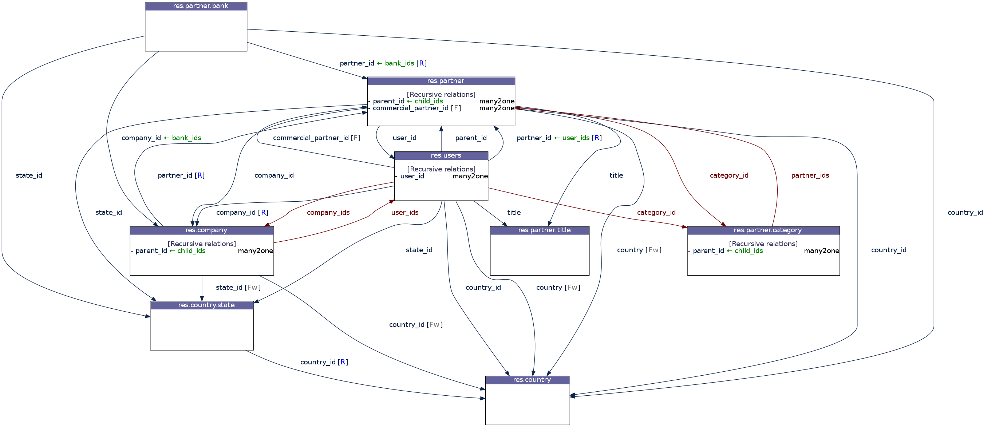
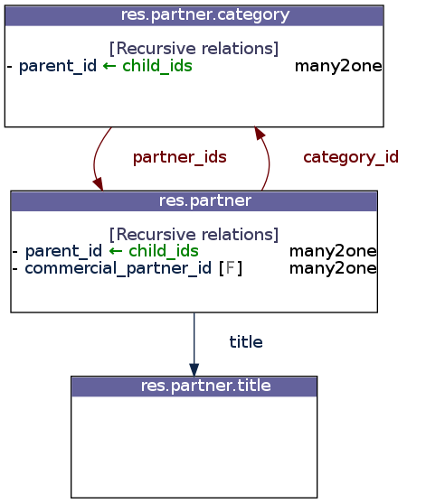
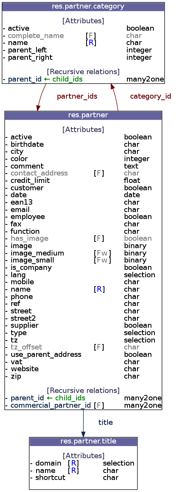
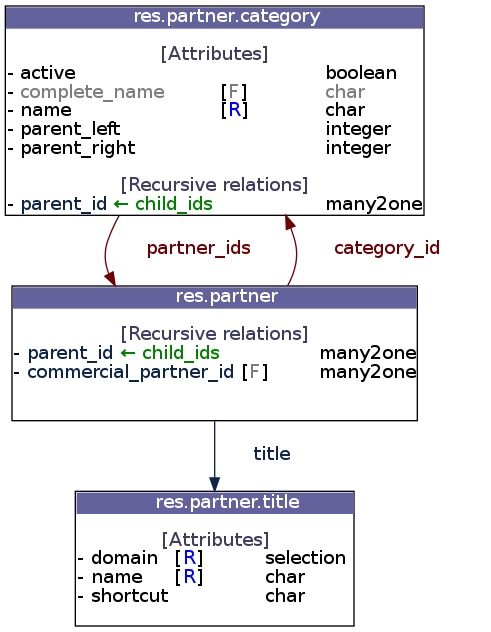

.. _tutorials:

Tutorials
=========

First step: prepare the connection and login
--------------------------------------------

You need an instance of the :class:`OERP <oerplib.OERP>` class to dialog with an
`OpenERP` server. Let's pretend that you want to connect as `admin` on the
`db_name` database of the local `OpenERP` server (with the `XML-RPC` service
which listens on port `8071`). First, prepare the connection::

    >>> import oerplib
    >>> oerp = oerplib.OERP(server='localhost', protocol='xmlrpc', port=8071)

You can also specify the default database to use with the `database` parameter::

    >>> oerp = oerplib.OERP(server='localhost', database='db_name', protocol='xmlrpc', port=8071)

To check databases available, use the :attr:`oerp.db <oerplib.OERP.db>`
attribute with the **list** method::

    >>> oerp.db.list()
    ['db_name', 'db_name2', ...]

The connection is ready, you are able to log in on the server with the account
of your choice::

    >>> user = oerp.login(user='admin', passwd='admin')

Or, if no default database was specified before::

    >>> user = oerp.login(user='admin', passwd='admin', database='db_name')

The ``login`` method returns an object representing the user connected.
It is built from the server-side model ``res.users``, and all its
informations are accessible (see :ref:`browse-records` section)::

    >>> print(user.name)            # print the full name of the user
    >>> print(user.company_id.name) # print the name of its company

Now you are connected, you can easily execute any kind of `RPC` queries on the
the `OpenERP` server (execute model methods, trigger workflow, download reports,
and handle wizards).

.. _tutorials-execute-queries:

Execute queries
---------------

The basic method to execute queries (related to the ``/object`` `RPC` service)
is :func:`execute <oerplib.OERP.execute>`.
It takes at least two parameters (model name and the method name)
following by variable parameters according to the method called. Example::

    >>> order_data = oerp.execute('sale.order', 'read', [1], ['name'])

This instruction will call the ``read`` method of the model ``sale.order``
with the parameters ``[1]`` (list of record IDs) and ``['name']`` (list of
fields to return).

However, for usual methods such as ``create``, ``read``, ``write``, ``unlink``
and ``search`` there are convenient shortcuts available (see
:class:`oerplib.OERP`)::

    >>> partner_id = oerp.create('res.partner', {'name': 'Jacky Bob', 'lang': 'fr_FR'})
    >>> partner_data = oerp.read('res.partner', [partner_id], ['name'])
    >>> oerp.write('res.partner', [partner_id], {'name': 'Charly Bob'})
    True
    >>> partner_ids = oerp.search('res.partner', [('name', 'ilike', 'Bob')])
    >>> oerp.unlink('res.partner', [partner_id])
    True

There is another way to perform all methods of a model, with the
:func:`get <oerplib.OERP.get>` method, which provide an API
almost syntactically identical to the `OpenERP` server side API
(see :class:`oerplib.service.osv.Model`)::

    >>> user_obj = oerp.get('res.users')
    >>> user_obj.write([1], {'name': "Dupont D."})
    True
    >>> context = user_obj.context_get()
    >>> context
    {'lang': 'fr_FR', 'tz': False}
    >>> product_obj = oerp.get('product.product')
    >>> product_obj.name_get([3, 4])
    [[3, '[PC1] PC Basic'], [4, u'[PC2] Basic+ PC (assembl\xe9 sur commande)']]

If you run an `OpenERP` version `6.1` or above, the user context is
automatically sent.
You can disable this behaviour with the :attr:`oerplib.OERP.config` property::

    >>> oerp.config['auto_context'] = False
    >>> product_obj.name_get([3, 4])    # Without context, lang 'en_US' by default
    [[3, '[PC1] Basic PC'], [4, '[PC2] Basic+ PC (assembly on order)']]

.. note::

    The ``auto_context`` option only affect model methods.

Here is another example of how to install a module (you have to be logged
as an administrator to perform this task). The ``button_immediate_install``
method used here is available since `OpenERP v6.1`::

    >>> module_obj = oerp.get('ir.module.module')
    >>> module_id = module_obj.search([('name', '=', 'purchase')])
    >>> module_obj.button_immediate_install(module_id)

.. _browse-records:

Browse records
--------------

A great functionality of `OERPLib` is its ability to generate objects that are
similar to browsable records found on the `OpenERP` server. All this
is possible using the :func:`browse <oerplib.OERP.browse>` method::

    # fetch one record
    partner = oerp.browse('res.partner', 1) # Partner ID = 1
    print(partner.name)
    # fetch several records
    for partner in oerp.browse('res.partner', [1, 2]):
        print(partner.name)

From such objects, it is possible to easily explore relationships. The related
records are generated on the fly::

    partner = oerp.browse('res.partner', 3)
    for addr in partner.address:
        print(addr.name)

You can browse objects through a :class:`model <oerplib.service.osv.Model>`
too. In fact, both methods are strictly identical,
:func:`oerplib.OERP.browse` is simply a shortcut to the other::

    >>> partner1 = oerp.browse('res.partner', 3)
    >>> partner2 = oerp.get('res.partner').browse(3)
    >>> partner1 == partner2
    True

Outside relation fields, Python data types are used, like ``datetime.date`` and
``datetime.datetime``::

    >>> order = oerp.browse('purchase.order', 42)
    >>> order.minimum_planned_date
    datetime.datetime(2012, 3, 10, 0, 0)
    >>> order.date_order
    datetime.date(2012, 3, 8)

A list of data types used by ``browse_record`` fields are
available :ref:`here <fields>`.

Update data through browsable records
-------------------------------------

Update data of a browsable record is workable with the
:func:`write_record <oerplib.OERP.write_record>` method of an
:class:`OERP <oerplib.OERP>` instance. Let's update the first contact's
name of a partner::

    >>> addr = list(partner.address)[0] # Get the first address
    >>> addr.name = "Caporal Jones"
    >>> oerp.write_record(addr)

This is equivalent to::

    >>> addr_id = list(partner.address)[0].id
    >>> oerp.write('res.partner.address', [addr_id], {'name': "Caporal Jones"})

Char, Float, Integer, Boolean, Text and Binary
''''''''''''''''''''''''''''''''''''''''''''''

As see above, it's as simple as that::

    >>> partner.name = "OpenERP"
    >>> oerp.write_record(partner)

Selection
'''''''''

Same as above, except there is a check about the value assigned. For instance,
the field ``type`` of the ``res.partner.address`` model accept values contains
in ``['default', 'invoice', 'delivery', 'contact', 'other']``::

    >>> my_partner_address.type = 'default' # Ok
    >>> my_partner_address.type = 'foobar'  # Error!
    Traceback (most recent call last):
      File "<stdin>", line 1, in <module>
      File "oerplib/fields.py", line 58, in setter
        value = self.check_value(value)
      File "oerplib/fields.py", line 73, in check_value
        field_name=self.name,
    ValueError: The value 'foobar' supplied doesn't match with the possible values '['default', 'invoice', 'delivery', 'contact', 'other']' for the 'type' field

Many2One
''''''''

You can also update a ``many2one`` field, with either an ID or a browsable
record::

    >>> addr.partner_id = 42 # with an ID
    >>> oerp.write_record(addr)
    >>> partner = oerp.browse('res.partner', 42) # with a browsable record
    >>> addr.partner_id = partner
    >>> oerp.write_record(addr)

You can't put any ID or browsable record, a check is made on the relationship
to ensure data integrity::

    >>> user = oerp.browse('res.users', 1)
    >>> addr = oerp.browse('res.partner.address', 1)
    >>> addr.partner_id = user
    Traceback (most recent call last):
      File "<stdin>", line 1, in <module>
      File "oerplib/fields.py", line 128, in setter
        o_rel = self.check_value(o_rel)
      File "oerplib/fields.py", line 144, in check_value
        field_name=self.name))
    ValueError: Instance of 'res.users' supplied doesn't match with the relation 'res.partner' of the 'partner_id' field.

One2Many and Many2Many
''''''''''''''''''''''

``one2many`` and ``many2many`` fields can be updated by providing
a list of tuple as specified in the `OpenERP` documentation, a list of records,
a list of record IDs or an empty list or ``False``:

With a standard `OpenERP` tuple, no magic here::

    >>> user = oerp.get('res.users').browse(1)
    >>> user.groups_id = [(6, 0, [8, 5, 6, 4])]
    >>> oerp.write_record(user)

With a list of records::

    >>> user = oerp.get('res.users').browse(1)
    >>> groups = oerp.get('res.groups').browse([8, 5, 6, 4])
    >>> user.groups_id = list(groups)
    >>> oerp.write_record(user)

With a list of record IDs::

    >>> user = oerp.get('res.users').browse(1)
    >>> user.groups_id = [8, 5, 6, 4]
    >>> oerp.write_record(user)

The last two examples are equivalent to the first (they generate a
``(6, 0, IDS)`` tuple).

However, if you set an empty list or ``False``, a ``(5, )`` tuple will be
generated to cut the relation between records::

    >>> user = oerp.get('res.users').browse(1)
    >>> user.groups_id = []
    >>> list(user.groups_id)
    []
    >>> user.__data__['updated_values']['groups_id']
    [(5,)]
    >>> user.groups_id = False
    >>> list(user.groups_id)
    []
    >>> user.__data__['updated_values']['groups_id']
    [(5,)]

Another facility provided by `OERPLib` is adding and removing objects using
`Python` operators ``+=`` and ``-=``. As usual, you can add an ID,
a record, or a list of them:

With a list of records::

    >>> user = oerp.get('res.users').browse(1)
    >>> groups = oerp.get('res.groups').browse([4, 5])
    >>> user.groups_id += list(groups)
    >>> [g.id for g in user.groups_id]
    [1, 2, 3, 4, 5]

With a list of record IDs::

    >>> user.groups_id += [4, 5]
    >>> [g.id for g in user.groups_id]
    [1, 2, 3, 4, 5]

With an ID only::

    >>> user.groups_id -= 4
    >>> [g.id for g in user.groups_id]
    [1, 2, 3, 5]

With a record only::

    >>> group = oerp.get('res.groups').browse(5)
    >>> user.groups_id -= group
    >>> [g.id for g in user.groups_id]
    [1, 2, 3]

Reference
'''''''''

To update a ``reference`` field, you have to use either a string or a browsable
record as below::

    >>> helpdesk = oerp.browse('crm.helpdesk', 1)
    >>> helpdesk.ref = 'res.partner,1' # with a string with the format '{relation},{id}'
    >>> oerp.write_record(helpdesk)
    >>> partner = oerp.browse('res.partner', 1)
    >>> helpdesk.ref = partner # with a browsable record
    >>> oerp.write_record(helpdesk)

A check is made on the relation name::

    >>> helpdesk.ref = 'foo.bar,42'
    Traceback (most recent call last):
      File "<stdin>", line 1, in <module>
      File "oerplib/service/osv/fields.py", line 213, in __set__
        value = self.check_value(value)
      File "oerplib/service/osv/fields.py", line 244, in check_value
        self._check_relation(relation)
      File "oerplib/service/osv/fields.py", line 225, in _check_relation
        field_name=self.name,
    ValueError: The value 'foo.bar' supplied doesn't match with the possible values '['res.partner', 'calendar.event', 'crm.meeting']' for the 'ref' field

Date and Datetime
'''''''''''''''''

``date`` and ``datetime`` fields accept either string values or
``datetime.date/datetime.datetime`` objects.

With ``datetime.date`` and ``datetime.datetime`` objects::

    >>> order = oerp.browse('purchase.order', 42)
    >>> order.date_order = datetime.date(2011, 9, 20)
    >>> order.minimum_planned_date = datetime.datetime(2011, 9, 20, 12, 31, 24)
    >>> oerp.write_record(order)

With formated strings::

    >>> order.date_order = "2011-09-20"                     # %Y-%m-%d
    >>> order.minimum_planned_date = "2011-09-20 12:31:24"  # %Y-%m-%d %H:%M:%S
    >>> oerp.write_record(order)

As always, a wrong type will raise an exception::

    >>> order.date_order = "foobar"
    Traceback (most recent call last):
      File "<stdin>", line 1, in <module>
      File "oerplib/fields.py", line 187, in setter
        value = self.check_value(value)
      File "oerplib/fields.py", line 203, in check_value
        self.pattern))
    ValueError: Value not well formatted, expecting '%Y-%m-%d' format

Generate reports
----------------

Another nice functionnality is the reports generation (related to the
``/report`` `RPC` service) with the :func:`report <oerplib.OERP.report>` method.
You have to supply the name of the report, the name of the model and
the ID of the record related::

    >>> oerp.report('sale.order', 'sale.order', 1)
    '/tmp/oerplib_uJ8Iho.pdf'
    >>> oerp.report('webkitaccount.invoice', 'account.invoice', 1)
    '/tmp/oerplib_r1W9jG.pdf'

The method will return the path to the generated temporary report file.

Manage databases
----------------

You can manage `OpenERP` databases with the :attr:`oerplib.OERP.db` property.
It offers you a dynamic access to all methods of the ``/db`` RPC service in
order to list, create, drop, dump, restore databases and so on.

.. note::
    You have not to be logged in to perform database management tasks.
    Instead, you have to use the "super admin" password.

Prepare a connection::

    >>> import oerplib
    >>> oerp = oerplib.OERP(server='localhost')

At this point, you are able to list databases of this server::

    >>> oerp.db.list()
    []

Let's create a new database::

    >>> database_id = oerp.db.create('super_admin_passwd', 'test_db', False, 'fr_FR', 'admin')

The creation process may take some time on the `OpenERP` server, and you have
to wait before using the new database. The state of the creation process is
returned by the
:func:`get_progress <oerplib.service.db.DB.get_progress>` method::

    >>> database_id = oerp.db.create('super_admin_passwd', 'test_db', False, 'fr_FR', 'admin')
    >>> while not oerp.db.get_progress('super_admin_passwd', database_id)[0]
    ...     pass
    >>> oerp.login('admin', 'admin', 'test_db')

However, `OERPLib` simplifies this by providing the
:func:`create_and_wait <oerplib.service.db.DB.create_and_wait>` method::

    >>> oerp.db.create_and_wait('super_admin_passwd', 'test_db', False, 'fr_FR', 'admin')
    [{'login': u'admin', 'password': u'admin', 'name': u'Administrator'},
     {'login': u'demo', 'password': u'demo', 'name': u'Demo User'}]

Some documentation about methods offered by the `OpenERP` ``/db`` RPC service
is available :class:`here <oerplib.service.db.DB>`.

Inspect the metadata of OpenERP **(New in version 0.8)**
--------------------------------------------------------

Draw a graph of the relationships between models
''''''''''''''''''''''''''''''''''''''''''''''''

.. note::
    This functionality requires the installation of `pydot <http://code.google.com/p/pydot/>`_.

The :func:`relations <oerplib.service.inspect.Inspect.relations>` method will help you
to generate a graphic of such relationships::

    >>> graph = oerp.inspect.relations(['res.partner'])
    >>> graph.write('rel_res_partner_v1.png', format='png')

    Legend:

    +--------------------------------------------+-----------------------------------------+
    | Element                                    | Meaning                                 |
    +============================================+=========================================+
    | .. raw:: html                              | many2one                                |
    |                                            |                                         |
    |    partner_id |                                         |
    +--------------------------------------------+-----------------------------------------+
    | .. raw:: html                              | one2many                                |
    |                                            |                                         |
    |    bank_ids   |                                         |
    +--------------------------------------------+-----------------------------------------+
    | .. raw:: html                              | many2many                               |
    |                                            |                                         |
    |    company_ids|                                         |
    +--------------------------------------------+-----------------------------------------+
    | .. raw:: html                              | Field required                          |
    |                                            |                                         |
    |    [R]           |                                         |
    +--------------------------------------------+-----------------------------------------+
    | .. raw:: html                              | Field function (readonly)               |
    |                                            |                                         |
    |    [F]        |                                         |
    +--------------------------------------------+-----------------------------------------+
    | .. raw:: html                              | Field function (writable)               |
    |                                            |                                         |
    |    [Fw]       |                                         |
    +--------------------------------------------+-----------------------------------------+

By default, only the direct relationships of the model ``res.partner`` are shown
(this behaviour can be changed with the ``maxdepth`` parameter), and model
attributes are hidden.
You can control the displayed models through the ``whitelist`` and ``blacklist``
parameters. For instance, assume that you only want data models whose name
begins with `res.partner`:

.. note::
    The blacklist has a higher priority than the whitelist

::

    >>> graph = oerp.inspect.relations(['res.partner'], whitelist=['res.partner*'], blacklist=['res.partner.bank'])  # Notice the use of wildcard here
    >>> graph.write('rel_res_partner_v2.png', format='png')

To display attributes, use the ``attrs_whitelist`` parameter. A wildcard is
used here to show attributes of all models (but you can specify which models
you want)::

    >>> graph = oerp.inspect.relations(['res.partner'], whitelist=['res.partner*'], blacklist=['res.partner.bank'], attrs_whitelist=['*'])
    >>> graph.write('rel_res_partner_v3.png', format='png')

To hide attributes of some models, you can use the ``attrs_blacklist``
parameter::

    >>> graph = oerp.inspect.relations(['res.partner'], whitelist=['res.partner*'], blacklist=['res.partner.bank'], attrs_whitelist=['*'], attrs_blacklist=['res.partner'])
    >>> graph.write('rel_res_partner_v4.png', format='png')

Draw a graph of the dependencies between modules
''''''''''''''''''''''''''''''''''''''''''''''''

.. note::
    This functionality requires the installation of `pydot <http://code.google.com/p/pydot/>`_.

The :func:`dependencies <oerplib.service.inspect.Inspect.dependencies>` method
will help you to generate a graphic of such dependencies::

    >>> graph = oerp.inspect.dependencies(['res.partner'])
    >>> graph.write('dep_res_partner_v1.png', format='png')

.. figure:: _static/dep_res_partner_v1.png
    :width: 100%

By default all modules are shown on the resulting graph, and `models`
are highlighted among them.
To hide "noisy" modules and restrict the resulting graph only to
data models that interest you, add the ``restrict=True`` parameter::

    >>> graph = oerp.inspect.dependencies(['res.partner'], restrict=True)
    >>> graph.write('dep_res_partner_v2.png', format='png')

.. image:: _static/dep_res_partner_v2.png
    :width: 500px

Scan the views of data models to list `on_change` methods
'''''''''''''''''''''''''''''''''''''''''''''''''''''''''

`on_change` functions of a model can be listed with the
:func:`scan_on_change <oerplib.service.inspect.Inspect.scan_on_change>` method.
Each detected function can be present on several views::

    >>> oerp.inspect.scan_on_change(['res.partner'])
    {'res.partner': {'onchange_address': {'base.view_partner_form': {'parent_id': ['use_parent_address', 'parent_id'],
                                                                     'use_parent_address': ['use_parent_address', 'parent_id']}},
                     'onchange_state': {'base.view_partner_form': {'state_id': ['state_id']}},
                     'onchange_type': {'base.view_partner_form': {'is_company': ['is_company']},
                                       'base.view_partner_simple_form': {'is_company': ['is_company']}}}}

The dictionary returned is formatted as follows: ``{model: {on_change: {view_name: field: [args]}}}``

Save the session to open it quickly later **(New in version 0.8)**
------------------------------------------------------------------

Once you are authenticated with your :class:`OERP <oerplib.OERP>` instance, you
can :func:`save <oerplib.OERP.save>` these connection information under a code
name and use this one to quickly instanciate a new :class:`OERP <oerplib.OERP>`
class::

    >>> import oerplib
    >>> oerp = oerplib.OERP('localhost')
    >>> user = oerp.login('admin', 'admin', 'my_database')
    >>> oerp.save('foo')

By default, these informations are stored in the ``~/.oerplibrc`` file. You can
however use another file::

    >>> oerp.save('foo', '~/my_own_oerplibrc')

Then, use the :func:`oerplib.OERP.load` method::

    >>> import oerplib
    >>> oerp = oerplib.OERP.load('foo')

Or, if you have saved your configuration in another file::

    >>> oerp = oerplib.OERP.load('foo', '~/my_own_oerplibrc')

You can check available sessions with :func:`oerplib.OERP.list`, and remove
them with :func:`oerplib.OERP.remove` ::

    >>> oerplib.OERP.list()
    ['foo']
    >>> oerplib.OERP.remove('foo')
    >>> 'foo' not in oerplib.OERP.list()
    True

Change the timeout
------------------

By default, the timeout is set to 120 seconds for all RPC requests.
If your requests need a higher timeout, you can set it through the
:attr:`oerplib.OERP.config` property::

    >>> oerp.config['timeout']
    120
    >>> oerp.config['timeout'] = 300  # Set the timeout to 300 seconds

